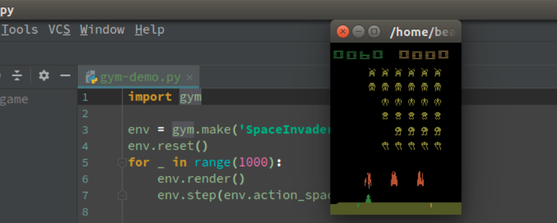
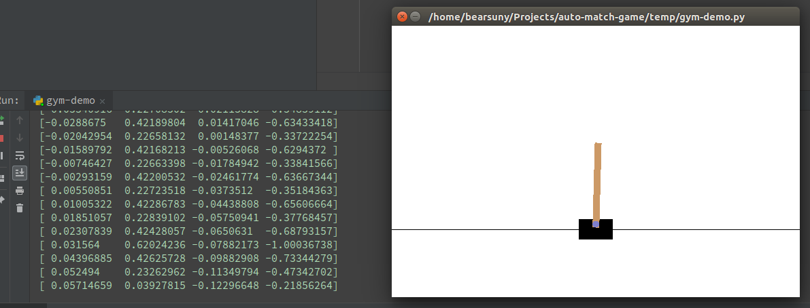
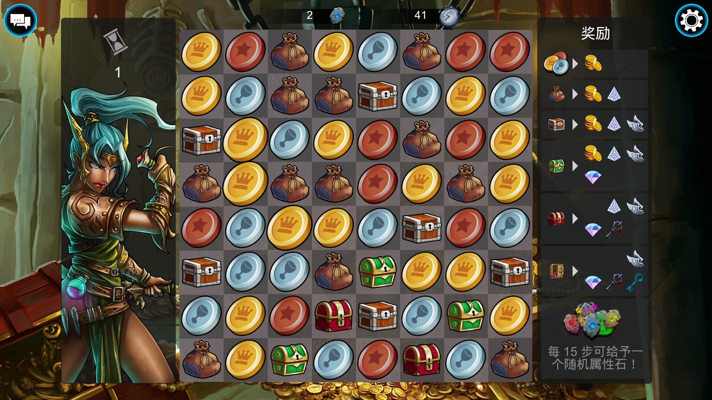
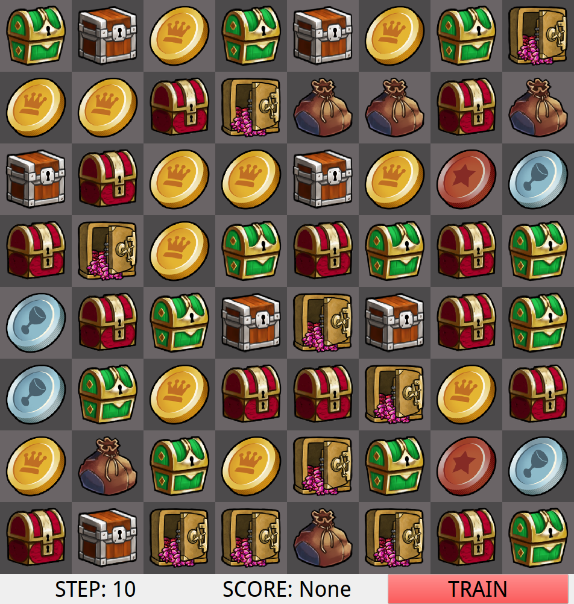
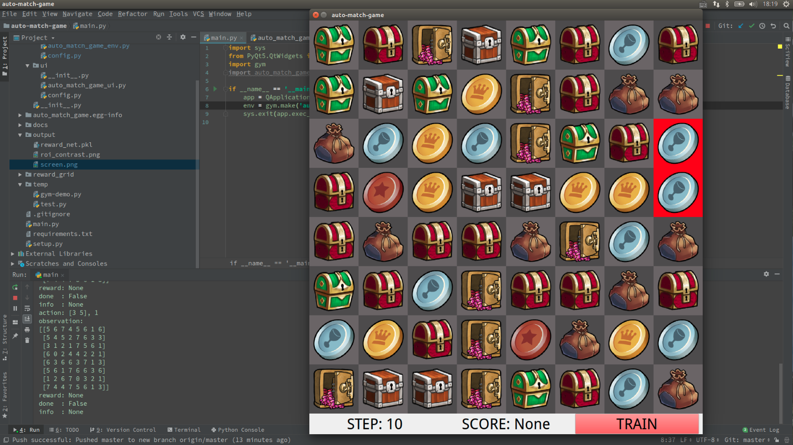

[TOC]

# 强化学习：第一次作业

## 你的专业是什么？准备用强化学习解决什么问题？

专业是控制科学与工程，研究方向是使用深度学习来解决认知科学领域的相关问题。

我想使用强化学习来解决**有限步数下附加奖赏的三消游戏**问题（参见2.2.1节）。

## 编程作业

### 尝试使用gym自带的环境

#### 环境配置

- ubuntu 16.04，i7-6700HQ，16GB RAM，GeForce GTX 1060 6GB
- python==3.6.6
- gym==0.10.5

> **OpenAI Gym is a toolkit for developing and comparing reinforcement learning algorithms.** This is the `gym` open-source library, which gives you access to a standardized set of environments.

使用`pip install gym`命令安装的是`gym`精简版，为了使用`Atari`、`MuJoCo`等环境库需要安装完整版`gym`：

```bash
apt-get install -y python-pyglet python3-opengl zlib1g-dev libjpeg-dev patchelf cmake swig libboost-all-dev libsdl2-dev libosmesa6-dev xvfb ffmpeg
```

```bash
git clone https://github.com/openai/gym.git
cd gym
pip install -e '.[all]'
```

#### 使用gym：运行Demo示例

阅读[gym官方文档](https://gym.openai.com/docs/)，运行`SpaceInvaders-v0`场景（如图）

```python
import gym

env = gym.make('SpaceInvaders-v0')
env.reset()
for _ in range(1000):
    env.render()
    env.step(env.action_space.sample())
```



#### 使用gym：输出观测（observations）信息

观测信息的值由`step()`函数返回，图中左侧的输出即为每次迭代执行`step()`后的观测信息的值：

```python
observation, reward, done, info = env.step(action)
```



#### 使用gym：输出观测空间（observation_space）和动作空间（action_space）

gym中，`observation_space`和`action_space`是属于`Space`类型的、分别描述环境（Environment）中有效的观测（Observation）和动作（Action）。

Demo`CartPole-v0`中的`action_space`是离散的二值变量，`observation_space`则是连续的二维空间。

```python
import gym
env = gym.make('CartPole-v0')
print(env.action_space)
#> Discrete(2)
print(env.observation_space)
#> Box(4,)
```

### 附加：利用熟悉的语言开发自己的仿真环境

#### 问题描述：有限步数下附加奖赏的三消游戏问题

问题来源于一款steam上的游戏**Gems of war**，该游戏内置一个宝石消除类型的小游戏（如下图）。

在8*8的网格中，游戏玩家选定某一个网格中的物体，然后上/下/左/右与其他网格中的物体交换位置。交换后，若某一行或某一列中存在某种相同类型的物体连续排列的个数大于等于3，则该连续排列从网格中移除，并产生一个比该类型物体等级高一级的物体。物体的等级按照铜币、银币、金币、袋子、木箱子、绿箱子、红箱子、金箱子依次提升。三个及以上的金箱子不会被消除。

消除后，比消除的物体位置高的其他网格中的物体会落下，以填补消除后的空白。随机生成的物体会弥补因填补空白所产生的网格上方的残缺。

初始时，游戏玩家只能执行10步（图中左侧沙漏下方的数字）操作。如果在交换后，存在4个及以上的连续排列被消除，那么玩家的执行步数加一。在玩家的执行步数归零之后，游戏会求和整个网格中不同物体的数量与各自类型得分的乘积来计算奖赏。



#### 仿真环境：Auto-Match-Game

##### 环境配置

- Ubuntu 16.04
- 需要GPU（cuda）的支持
- Python==3.6.6
- 主要依赖：gym、pytorch、pyqt5、numpy

```bash
git clone git@gitlab.com:fengbear/auto-match-game.git
source activate [自己的python3.6虚拟环境]
pip install -r requirement.txt
python3 main.py
```

##### 仿真环境界面

在研究了gym的文档及源代码以后，我抛弃掉gym原生的界面实现。Auto-match-game的仿真环境界面主要使用pyqt5实现（如下图）。`auto_match_game_ui.py`是界面实现的源代码。整个界面由上下部分构成，上部分显示的是游戏面板，下部分是信息显示（玩家可以进行操作的步数/当前网格的奖赏）及训练按钮。



点击训练按钮后，程序开始进行三消仿真（如下图）。具体情形请参见附件视频`sample_train.avi`。红色背景的网格表示待交换的两个物体。如果交换后没有达到消除的条件，那么这两个物体的位置会交换回来，并且玩家的移动步数`STEP`也不会减少。否则，玩家的移动步数减一，程序会计算当前网格的奖赏。



上图中，仿真环境在每次执行`step()`函数后，均会产生`observation、reward、done、info`四个返回值（见PyCharm中terminal的输出）。`action`表示当前执行的操作，以下图为例，`[3 7]`表示玩家要操作的是第`4`行第`8`列的物体，`0`表示玩家将该物体与其上方的物体交换（0：向上，1：向右，2：向下，3：向左）。`observation`保存当前的网格矩阵信息。由于没有设置特别的采样规则，视频中演示的`action`采用的是`action = self.env.action_space.sample()`随机采样策略。

```python
action: [3 7], 0
observation:
[[2 2 4 2 3 2 3 3]
 [2 4 6 3 1 1 6 0]
 [6 2 4 6 2 7 0 1]
 [6 5 1 6 3 5 1 2]
 [4 7 3 4 3 2 3 2]
 [1 7 3 0 5 3 1 7]
 [6 2 0 2 7 2 5 7]
 [3 0 5 5 2 2 5 1]]
reward: 270
done  : False
info  : None
```

仿真环境可以进行用户自定义的配置，配置文件在`../auto_match_game/envs/config.py`，主要可以修改的是训练的轮数及单次训练中的最大步数。

```python
class AutoMatchGameEnvConfig:
    # user setting
    train_max_epochs = 50
    train_max_steps = 100
    sleep_msec = 1000
    game_steps = 10
```

##### 实现细节——物体分类的CNN网络

为了让仿真环境能够通过视觉来识别网络中的物体（不依赖于网格构建时的矩阵），我构建了一个CNN（3层卷积3层全连接）来对网格中的物体进行分类。网络的实现、训练及评估均在`../reward_grid/`文件夹中。模型存放在`../output/reward_grid.pkl`。因为分类网络的训练集（参见`../reward_grid/data文件夹`）使用的是游戏中不同种类的物体图片，待分类的物体同样是上述图片，因此训练结果的准确率就是识别准确率。当前网络的识别准确率是`100%`。

##### 实现细节——判断消除的规则

判断消除的规则我参考youtube上的视频[Algorithm ideas for a 3-gem match game (Bejeweled)](https://www.youtube.com/watch?v=PJGZOouj0TE)，并以此来实现仿真环境中的消除算法。

##### 实现细节——与`gym`环境的差异

`gym`环境下，编写训练的代码通常是利用两个`for`循环来实现：

```python
import gym
env = gym.make('CartPole-v0')
for i_episode in range(20):
    observation = env.reset()
    for t in range(100):
        env.render()
        print(observation)
        action = env.action_space.sample()
        observation, reward, done, info = env.step(action)
        if done:
            print("Episode finished after {} timesteps".format(t+1))
            break
```

由于我使用的是pyqt5来实现仿真界面，用于显示界面的UI线程是不能被阻塞的，因此对于`gym`环境中原生的`render()`、`step()`、`reset()`函数我通过多线程及pyqt中特有的信号`signal`与槽`slot`实现。具体的实现位于`../auto_match_game/envs/auto_match_game_env.py`，多线程由`AutoMatchGameThread`类实现。**训练流程在`AutoMatchGameThread`类中的`run()`函数实现**。`render()`、`step()`、`reset()`函数的执行通过`step_signal `、`reset_signal `、`render_signal`实现。实现后的仿真环境的训练流程如下：

```python
    def run(self):
        for i in range(EC.train_max_epochs):
            self.reset_signal.emit()
            for j in range(EC.train_max_steps):
                self.render_signal.emit()
                action = self.env.action_space.sample()
                self.step_signal.emit(action)
                QThread.msleep(EC.sleep_msec)
                if self.done:
                    print(f'Epoch {i:03}, Step {j:03} steps, Reward is {self.reward}.')
                    break
        print('Train done.')
        self.stop()
```

若要使用仿真环境，只需要参考`../main.py`中的写法即可，对该仿真环境的安装与gym中其他环境的安装方式相同：`pip install -e .`。

```python
import sys
from PyQt5.QtWidgets import QApplication
import gym
import auto_match_game

if __name__ == '__main__':
    app = QApplication(sys.argv)
    env = gym.make('auto-match-game-v0')
    sys.exit(app.exec_())
```

